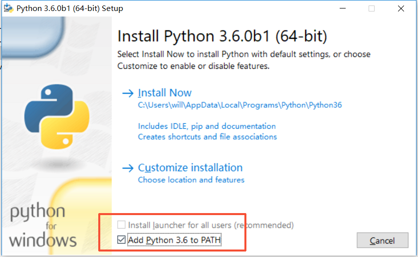

# 用户指南

## 安装过程

### 下载代码

* 代码地址: [https://github.com/will4906/TeacherRating](https://github.com/will4906/TeacherRating)

* 访问以上链接，点击下方图片的红框位置。


* 解压代码

### 环境准备（若已安装python环境则可跳过）

* 下载地址：[https://www.python.org/downloads/release/python-364/](https://www.python.org/downloads/release/python-364/)

* 根据系统是32或64位选择对应的软件下载.


* 安装python，切记勾选图片中标红位置



* 安装环境（必须联网）

* 双击下载的代码中的install.bat完成安装

* 若速度过慢可参考[http://blog.csdn.net/lambert310/article/details/52412059](http://blog.csdn.net/lambert310/article/details/52412059)

### 数据拷贝（若无数据文件可跳过）

将rating.db粘贴到下载的文件根目录下，覆盖掉原始的rating.db

### 启动程序

双击start.bat，若出现
```
Performing system checks...

System check identified no issues (0 silenced).
February 25, 2018 - 22:31:16
Django version 2.0.2, using settings 'TeacherRating.settings'
Starting development server at http://0.0.0.0:80/
Quit the server with CTRL-BREAK.
```
则启动成功，切记运行过程中不可关闭弹出的黑框。

### 进入网页

打开浏览器输入：localhost进入网页


## 问卷分享

### 局域网内

* 查看本机局域网ip地址，并将之前的localhost修改为ip地址输入浏览器。

* 根据班级跳转到各自的问卷细节界面，复制链接分享给问卷填写对象。
